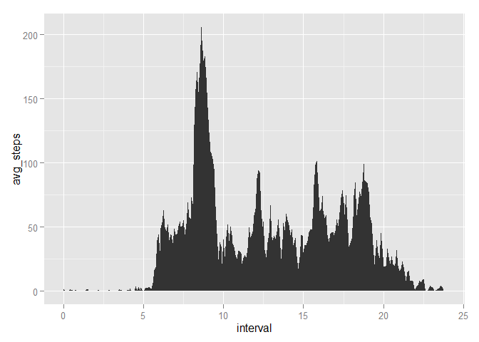
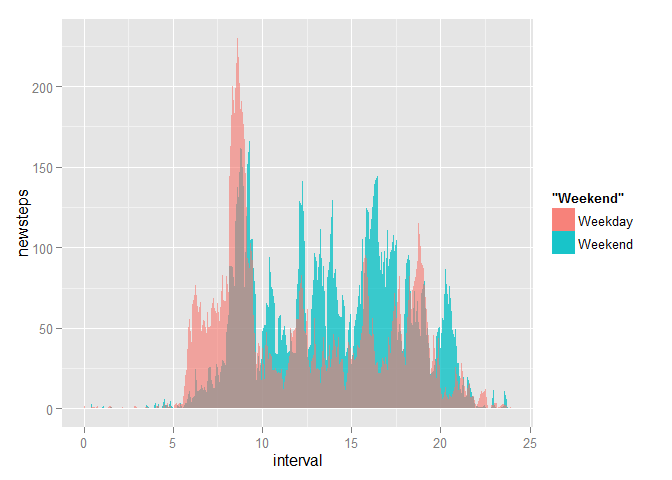
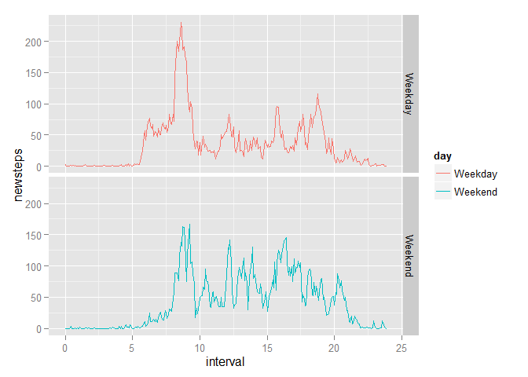

# Reproducible Research: Peer Assessment 1
Kenneth L Osborne III  


## Loading and preprocessing the data

The first thing we do is reqire that some libraries are in place before 
continuing.


```r
require(dplyr); require(ggplot2); require(lubridate)
```

Next, we unzip the downloaded data file and load the csv data.
I also print the head of our data so we know what we're working with.


```r
unzip("activity.zip")
activity <- read.csv("activity.csv", 
                    colClasses = c("integer","character","integer"))
head(activity)
```

```
##   steps       date interval
## 1    NA 2012-10-01        0
## 2    NA 2012-10-01        5
## 3    NA 2012-10-01       10
## 4    NA 2012-10-01       15
## 5    NA 2012-10-01       20
## 6    NA 2012-10-01       25
```

We see that the interval is not in an appropriate time format. It should be 
00:05, or something of the like.

First we'll convert the interval vector to a character vector that has exactly
4 digits, padding new digits with zeros with `sprintf`. Next we insert a colon 
after the first two digits with `gsub`. 

From the H:M format, we convert interval into a decimal number of hours.


```r
activity$interval <- activity$interval %>%
    sprintf("%04d", .) %>%
    sapply(function(x) gsub('^([0-9]{2})([0-9]+)$','\\1:\\2',x))

activity$interval <- sapply(strsplit(activity$interval, ":"),
                      function(x){
                          x <- as.numeric(x)
                          x[1]+x[2]/60
                      })

head(activity)
```

```
##   steps       date   interval
## 1    NA 2012-10-01 0.00000000
## 2    NA 2012-10-01 0.08333333
## 3    NA 2012-10-01 0.16666667
## 4    NA 2012-10-01 0.25000000
## 5    NA 2012-10-01 0.33333333
## 6    NA 2012-10-01 0.41666667
```

## What is mean total number of steps taken per day?

To answer this question, we group our data by date, summing up all the steps
taken on that date.
Next we find the arithmetic mean of the number of steps taken each day. We 
notice that there are some `NA` values in our data frame which we do not include 
in the sum for any given day.


```r
dayAvg <- group_by(activity, date) %>% 
    summarize(steps = sum(steps, na.rm = T))

mean(dayAvg$steps)
```

```
## [1] 9354.23
```


## What is the average daily activity pattern?

To find the average daily activity pattern, we summarize the data by the 
interval variable.


```r
intAvg <- group_by(activity, interval) %>% 
    summarize(avg_steps = mean(steps, na.rm= T))
```

We plot the average number of steps for each 5 minute interval.


```r
shade <- rbind(c(min(intAvg$interval),0), intAvg, c(max(intAvg$interval),0))
colnames(shade) <- c("x","y")

p<- ggplot(intAvg, aes(x = interval, y =avg_steps))
p + geom_polygon(data = shade, aes(x,y))
```

 

We see that the data indicate the most activity  between 7:30 and 9:45, some
activity from 5:30 to 22:00, and hardly any activity between 22:00 and 5:30.


## Imputing missing values

From `head` we noticed that there were `NA` values in `step`. We can calculate 
what portion of our data exactly are `NA` values.


```r
mean(is.na(activity$step))
```

```
## [1] 0.1311475
```

If we wanted to replace `NA` values in our data frame with other values, we could 
choose to impute the data based on the mean number of steps during an interval. 
To do this we merge `activity` and `intAvg` by `interval`.


```r
impute <- merge(activity, intAvg, by='interval', all=TRUE) %>% arrange(date, interval) 
head(impute)
```

```
##     interval steps       date avg_steps
## 1 0.00000000    NA 2012-10-01 1.7169811
## 2 0.08333333    NA 2012-10-01 0.3396226
## 3 0.16666667    NA 2012-10-01 0.1320755
## 4 0.25000000    NA 2012-10-01 0.1509434
## 5 0.33333333    NA 2012-10-01 0.0754717
## 6 0.41666667    NA 2012-10-01 2.0943396
```

Next we check if the number of steps 
exists. If it doesn't, we replace the number of steps with the average number of 
steps. We call this modified variable `newstep`.


```r
impute <- cbind(impute, newsteps = apply(impute, 1,  function(x) {
    if(is.na(x[2])) return(x[4])
    x[2]
}) ) %>% select(c(5,3,1))

impute %>% head
```

```
##      newsteps       date   interval
## 1   1.7169811 2012-10-01 0.00000000
## 2   0.3396226 2012-10-01 0.08333333
## 3   0.1320755 2012-10-01 0.16666667
## 4   0.1509434 2012-10-01 0.25000000
## 5   0.0754717 2012-10-01 0.33333333
## 6   2.0943396 2012-10-01 0.41666667
```


## Are there differences in activity patterns between weekdays and weekends?

We can now check if weekend activity patterns are different than weekday 
patterns. To do this we create a function that checks if a date corresponds 
to a weekend.


```r
is.wknd <- function(x) {
    day <- ymd(x) %>% weekdays
    if(day %in% c("Saturday","Sunday")) return("Weekend")
    "Weekday"
}
```

We make a new variable from the existing variable `date` using this function.


```r
wknd <- sapply(impute$date, is.wknd)
```

Then we add the new variable to our data frame. I try to coerce `newsteps` to 
`numeric`. It doesn't really work, as we can see, but I leave this step in 
because `summarize` freaks out otherwise. Haha R. You so cray.


```r
impute <- cbind(impute, day = wknd)
impute$newsteps <- impute$newsteps %>% as.character %>% as.numeric
impute %>%  as.tbl %>% head
```

```
## Source: local data frame [6 x 4]
## 
##    newsteps       date   interval     day
##       (dbl)      (chr)      (dbl)  (fctr)
## 1 1.7169811 2012-10-01 0.00000000 Weekday
## 2 0.3396226 2012-10-01 0.08333333 Weekday
## 3 0.1320755 2012-10-01 0.16666667 Weekday
## 4 0.1509434 2012-10-01 0.25000000 Weekday
## 5 0.0754717 2012-10-01 0.33333333 Weekday
## 6 2.0943396 2012-10-01 0.41666667 Weekday
```

We now plot weekday and weekend activity patterns.


```r
wkndIntAvg <- group_by(impute, day, interval) %>% 
    summarize(newsteps = mean(newsteps))
```

Since I figured out how to do a shaded plot, I did one here for both variables.


```r
shade1 <- rbind(c(0 ,0), wkndIntAvg[0  :288,2:3], c(24,0))
shade2 <- rbind(c(0 ,0), wkndIntAvg[289:576,2:3], c(24,0))

colnames(shade1) <- c("x", "y")
colnames(shade2) <- c("x", "y")

p<- ggplot(wkndIntAvg, aes(x = interval, y = newsteps))
p + geom_polygon(data = shade2, aes(x,y,fill = "Weekend"), alpha = .75) + 
    geom_polygon(data = shade1, aes(x,y,fill = "Weekday"), alpha = .6)
```

 

But the instructions say to have a multipanel plot, so I include that as well.


```r
p<- ggplot(wkndIntAvg, aes(x = interval, y = newsteps, color = day))
p + facet_grid(day ~ .) + geom_line()
```

 

As we can see from either of these plots, acitvity was much higher in the early 
morning during weekdays, and lower on average throughout most of the day 
otherwise.
